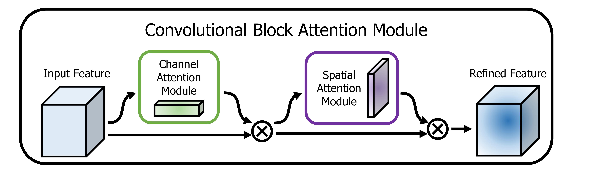

# AeroSegment: Semantic segmentation for aerial urban understanding

This repository presents a ground-up implementation of a semantic segmentation model using the U-Net architecture, further enriched with the Convolutional Bottleneck Attention Module (CBAM) to facilitate enhanced feature learning. The model aims to perform semantic understanding of urban scenes from aerial images, specifically for enhancing the safety of autonomous drone flight and landing procedures.

## Dataset Overview

The **Semantic Drone Dataset** is employed for training and evaluation. The dataset focuses on providing a semantic understanding of urban scenes captured from a bird's eye view using a high-resolution camera. The key details of the dataset are as follows:

- The dataset comprises imagery from more than 20 houses captured at altitudes ranging from 5 to 30 meters above the ground.
- Images are acquired with a high-resolution camera at a size of 6000x4000 pixels (24 megapixels).
- The training set includes 400 publicly available images, while the test set consists of 200 private images.

You can download the dataset from [here](https://www.kaggle.com/datasets/bulentsiyah/semantic-drone-dataset).
## Model Architecture
The implemented model is based on the U-Net architecture, which has shown significant success in various semantic segmentation tasks. Additionally, the model incorporates the Convolutional Bottleneck Attention Module (CBAM) to enhance feature representation. 
### U-Net

The U-Net architecture, introduced by Ronneberger et al. in their landmark paper "U-Net: Convolutional Networks for Biomedical Image Segmentation" (2015), revolutionized image segmentation. This design employs an innovative "U" shape comprising an encoder and a decoder. The encoder captures global context via convolutions and pooling, while the decoder restores spatial information through transposed convolutions. Crucially, skip connections fuse high-level features from the encoder with intricate details from the decoder, enabling precise segmentation. The following figure demonstrates the overall architecture of the U-Net model:

### CBAM

The Convolutional Bottleneck Attention Module (CBAM), proposed by Woo et al. in "CBAM: Convolutional Block Attention Module" (2018), is an attention mechanism for CNNs. CBAM combines channel-wise and spatial attention to enhance feature representation by focusing on essential channels and spatial regions. The following figure shows an overview of the CBAM attention mechanism:

## Experimental Results

### Experimental Setup

The model underwent training using the Adam optimizer with a learning rate of 0.001 across 150 epochs. To ensure consistency and optimize processing, images were uniformly resized to dimensions of 256x256 pixels in height and width.

### Data Augmentation

Leveraging the Albumentations library, data augmentation techniques were applied to the training set, including horizontal and vertical flips, grid distortion, random brightness-contrast adjustments, and Gaussian noise. Correspondingly, validation images underwent augmentation through vertical and horizontal flips, along with grid distortion.

### Results
We evaluated our model using Pixel Accuracy (PA) and Mean Intersection over Union (MIoU) metrics. The model achieved an impressive **86.66%** PA and demonstrated a significant MIoU score of **0.5333**, underscoring its proficiency in semantic segmentation. To further illustrate the effectiveness of our model, we present visual comparisons between its segmentation results and the corresponding ground truth labels.

## Requirements
The following hardware and software were used for training the model:
- GPU: NVIDIA GeForce RTX 3090
- RAM: 24 GB SSD
- Operating System: Ubuntu 22.04.2 LTS
- Python version: 3.9.15
- PyTorch version: 2.0.1
- PyTorch CUDA version: 11.7

  
## Contributing
Contributions are welcome! :heart: Please open a pull request or issue for any improvements or bug fixes.

## License

This project is licensed under the [MIT License](LICENSE).
